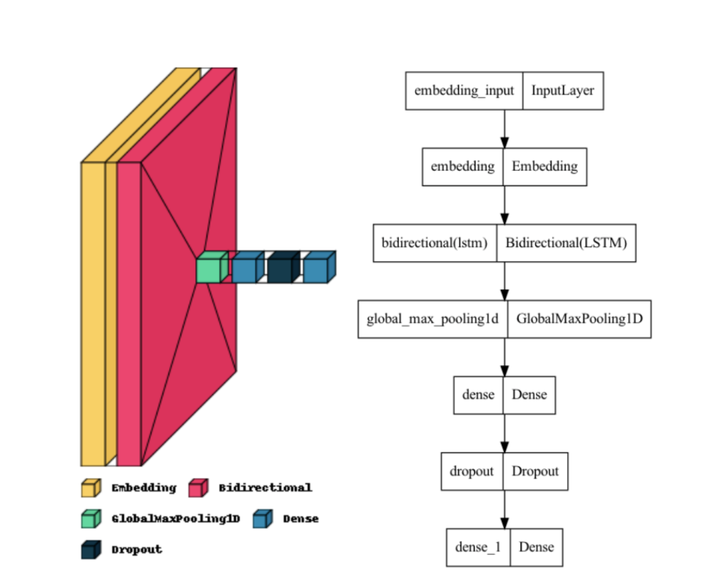

# **Sentiment Analysis of Food Insecurity**
### ***Using:*** 
 - ### *Transfer Learning: IMDb movie reviews (training data) --> Food Insecurity tweets (testing data)*
- ### Deep Learning: BiLSTM (Bidirectional Long Short Term Memory) Model*
### **Author:** Sudharsan Gopalakrishnan

## Abstract
> *Food insecurity exists globally through food deserts, places that have limited or no access to healthy food. Many underprivileged communities suffer from a lack of healthy food. Though many organizations are trying to tackle global food insecurity, not much progress has really been made. Sentiment Analysis, a popular branch of Natural Language Processing, is a solution with a high potential for success. This would help understand how different communities feel about the food they have access to as well as where exactly food insecurity may exist. Thus, the research question is what is an efficient method to apply sentiment analysis to analyze food insecurity and evaluate its severity throughout the world? The present paper discusses performing the Sentiment Analysis using Transfer and deep learning techniques and the programming language Python. The BiLSTM (Bidirectional Long Short Term Memory) model was used to analyze 1558 tweets from Twitter related to food insecurity. This model was trained and validated using 10-Fold Cross Validation with 50000 IMDb movie reviews and their respective sentiments, where the seventh fold had the highest accuracy of 88.42%. Word clouds as well as graphs showing the frequency of common words were then produced. After classifying the sentiment of the Twitter data as positive or negative, the tweets were mapped to their respective user locations, with which another set of word clouds was constructed. Based on the word clouds, counties such as India and the USA are countries likely to suffer from severe food insecurity.* [[1]](#1).

<a id="1">[1]</a> 
[Full Published Paper link](#Full-Published-Paper-link)

## Methods

### Data Collection
I mined 1558 tweets from Twitter using the Python <a href="https://www.tweepy.org/">Twitter API</a> called tweepy, which I classifed the sentiment of (positive or negative). I used Deep Learning for this research, so I would need a lot of training data for the model that I used. I chose to use 50000 IMDb movie reviews as my training data.

### BiLSTM
I used a BiLSTM (Bidirectional Long Short Term Memory) model in order to classify the sentiment. The model's architecture is displayed in the below diagrams. Through research, unlike the standard LSTM approach, a BiLSTM model involves its inputs flowing in both directions and is thus capable of using information from both of its sides.
###

###
Using transfer learning, I trained this model with the IMDb data and tested it with the Food Insecurity Twitter data.

## Full Published Paper link

