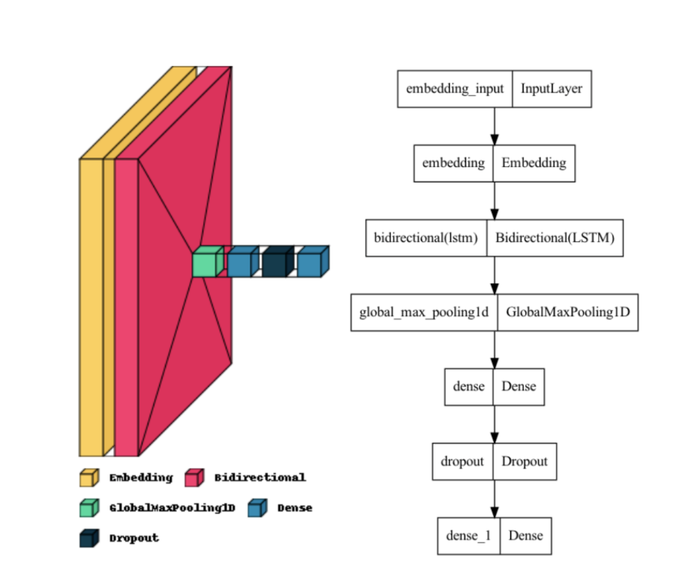

# Sentiment Analysis of Food Insecurity
### Using a Deep Learning Approach: BiLSTM (Bidirectional Long Short Term Memory) Model

## Abstract
A lot of food insecurity exists around the world in the form of food deserts, places that have limited or no access to food, especially healthy food. Many underprivileged and minority communities around the world suffer from a lack of food and resources. Though many organizations are trying to tackle global food insecurity, not much progress has really been made. Sentiment Analysis is a solution with a high potential for success. With this, we can understand how different communities feel about the food they have access to. The present paper then discusses performing the Sentiment Analysis using Deep Learning techniques and the programming language Python. I used the BiLSTM (Bidirectional Long Short Term Memory) model in order to analyze 490 tweets from Twitter related to food deserts. The BiLSTM model used in this research was trained with IMDb movie reviews and their sentiments. After testing the model on the tweets, I produced word clouds as well as graphs showing clusters of words and frequency of common words, respectively. After classifying the sentiment of the Twitter data as positive or negative, I connected in parallel the positive and negative tweets and their respective user locations, with which I constructed another set of word clouds. Using the positive and negative word clouds, people can get an idea of which regions of the world are more likely to have lower access to healthy food. 

## Methods

### Data Collection
I mined 490 tweets from Twitter using the Python <a href="https://www.tweepy.org/">Twitter API</a> called tweepy, which I classifed the sentiment of (positive or negative). I used Deep Learning for this research, so I would need a lot of training data for the model that I used. I chose to use 50000 IMDb movie reviews as my training data.

### BiLSTM
I used a BiLSTM (Bidirectional Long Short Term Memory) model in order to classify the sentiment. The model's architecture is displayed in the below diagrams. Through research, unlike the standard LSTM approach, a BiLSTM model involves its inputs flowing in both directions and is thus capable of using information from both of its sides.
###

###
I trained this model with the IMDb data and tested it with the Twitter data.

## Full Published Paper link:

